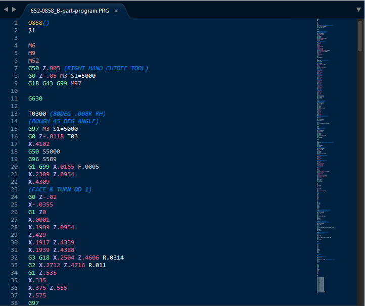

## Update by Gabriel Staples on 20 Mar 2022: I'm going to make my own version of this, here: https://github.com/ElectricRCAircraftGuy/sublime_gcode. Look there for all future contributions of mine for this.


# G-code syntax highlighting for Sublime Text
Syntax Definition for Sublime Text that provides highlighting for G code (ISO 6983, DIN 66025, RS-274)

[](docs/screenshot.png)


# Installation


## Package Control

Press <kbd>Ctrl</kbd> + <kbd>Shift</kbd> + <kbd>P</kbd> to open the console. Then:

Enter:
``` 
Package Control: Install Package
```

Then search for:
``` 
G code
```

Install the package, and enjoy! `G-code` is now available as one of the syntax highlighting options!


## Out of Maintenance 

<s>Hi, unfortunately I stopped maintaining this shortly after creating it. I use vim almost exclusively now, and lately there has not been much new g code to read.</s>

Picked back up by [Gabriel Staples](https://github.com/ElectricRCAircraftGuy) on 19 Mar. 2022.


# Notes to developers of this package

_Tested in Sublime Text 4 (build 4126) on Linux Ubuntu 20.04._


## References:
1. https://en.wikipedia.org/wiki/G-code
1. `.tmLanguage` and `.YAML-tmLanguage` files are apparently some sort of ubiquitous [TextMate](https://en.wikipedia.org/wiki/TextMate)-inspired language grammar files used for specifying syntax highlighting rules. 
1. Marlin g-code (for 3D printers) official reference pages: https://marlinfw.org/meta/gcode/
1. Sublime Text pages:
    1. Syntax Definitions: http://www.sublimetext.com/docs/syntax.html
    1. https://www.sublimetext.com/docs/syntax.html - explains how `.sublime-syntax` files are built and work.
1. Package Control: 
    1. Customizing Packages: https://packagecontrol.io/docs/customizing_packages
    1. Submitting a [new] Package: https://packagecontrol.io/docs/submitting_a_package
1. \*\*\*\*\*TextMate language grammars documentation: https://macromates.com/manual/en/language_grammars; ex:
    1. `support.variable`, `comment.line`, `markup.bold`, `support.function`, etc.
1. http://ilkinulas.github.io/programming/2016/02/05/sublime-text-syntax-highlighting.html - showed me that editing Monokai.tmTheme with your scope names and formatting is how you modify formatting for your custom syntax highlighting scopes. 
    1. NB: I later discovered on my own that I should NOT modify the Monokai color theme directly (since it now comes in a compressed location anyway, which location is intended NOT to be modified directly--see [my answer here](https://stackoverflow.com/a/71261397/4561887) and [this comment here](https://stackoverflow.com/questions/71261218/where-is-the-default-settings-file-which-stores-thing-such-as-font-size-loca/71261397#comment125983189_71261397)), but rather I should go to `Preferences` --> `Customize Color Scheme` and then edit the user settings in the right-hand side of the JSON file that comes by adding new dictionary entries for custom formatting under the `rules` list of dicts.
1. https://github.com/va9iff/SublimeNotePad - **incredibly** simple example of a package plugin in Sublime Text, with Python code to interact with the Sublime Text GUI and menus and things! See its request to be added to Package Control here: https://github.com/wbond/package_control_channel/pull/8481.
1. Scope namespacing (my comments about it) for syntax highlighters in Sublime Text: https://github.com/wbond/package_control_channel/pull/8454#issuecomment-1073181257


## Instructions

1. To have Sublime Text **auto-convert a Textmate `.tmLanguage` file into a `.sublime-syntax` file** for you, open up the `.tmLanguage` file in Sublime Text, then go to `Tools` --> `Developer` --> `"New Syntax from *.tmLanguage..."`. A file named `*.sublime-syntax` will be created and opened in Sublime Text, but you'll need to manually choose to save it somewhere if you want to keep it.
1. To **check a syntax highlighting scope of a particular place in a source code file**, in order to check to see if your syntax highlighting is working, or to see what scope a certain color and formatting come from for a syntax highlighting you like, place your cursor in the code where you want to check, then go to `Tools` --> `Developer` --> `Show Scope Name`. Click the "Copy" link in the little box that pops up over the source code if you'd like to copy that scope name.
1. See also my notes here: https://github.com/themachinist/gcode-syntax-highlighting/issues/2#issuecomment-1073127156
1. To **modify and test changes to this package locally**, ...
